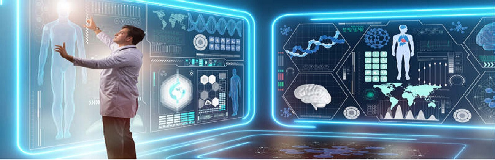

 

### I am Khush Patel, MD, a data scientist and a physician leveraging clinical knowledge and deep learning to solve real-world biomedical challenges. 

I have applied machine learning and data science tools to solve some of the most challenging biomedical issues using the largest collection of brain MRI, the largest collection of electronic health records (EHR) data, the largest collection of retina imaging data (2D fundus and 3D OCT retina images), the largest genetic data, microscopy images text and structured data.

<!--
**khushpatelmd/khushpatelmd** is a ✨ _special_ ✨ repository because its `README.md` (this file) appears on your GitHub profile.

Here are some ideas to get you started:

- 🔭 I’m currently working on ...
- 🌱 I’m currently learning ...
- 👯 I’m looking to collaborate on ...
- 🤔 I’m looking for help with ...
- 💬 Ask me about ...
- 📫 How to reach me: ...
- 😄 Pronouns: ...
- ⚡ Fun fact: ...
-->
